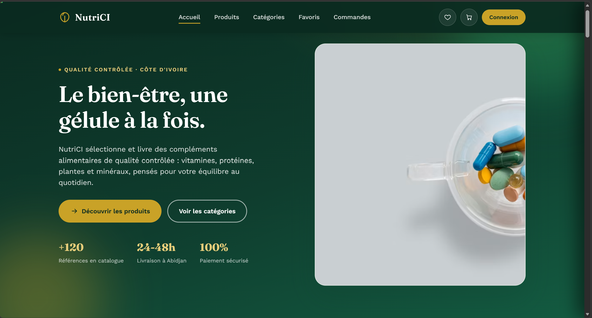
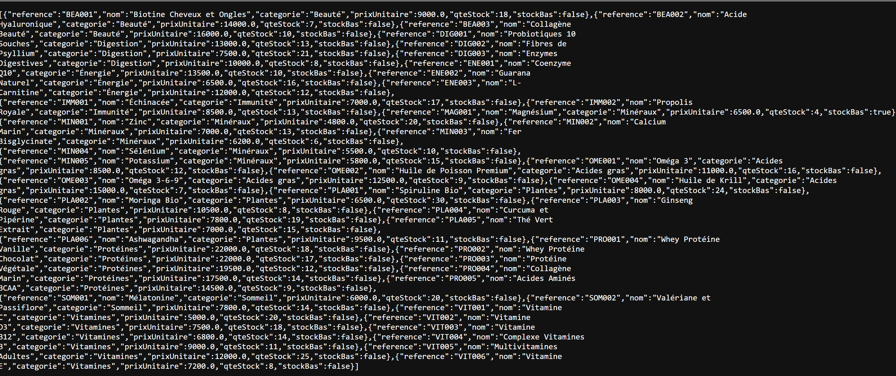
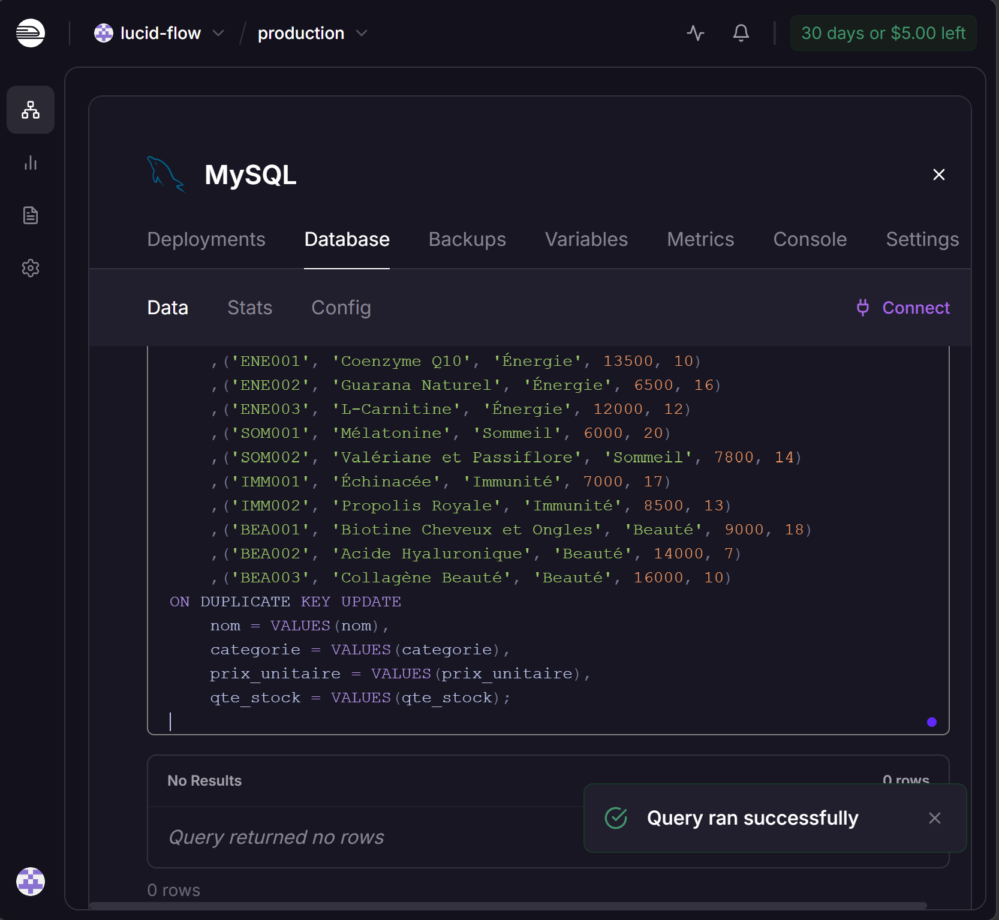
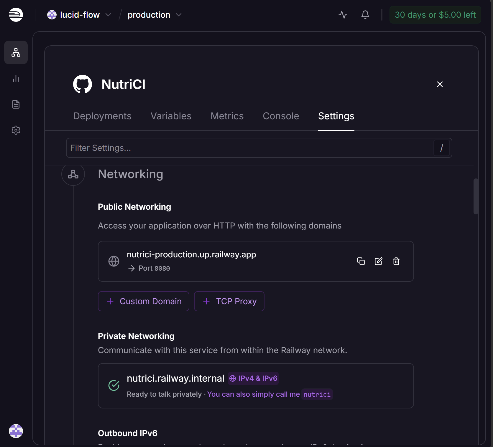
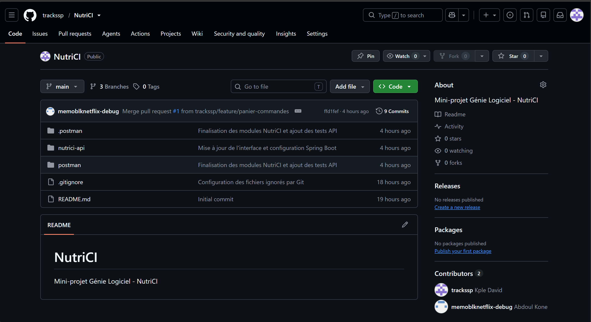
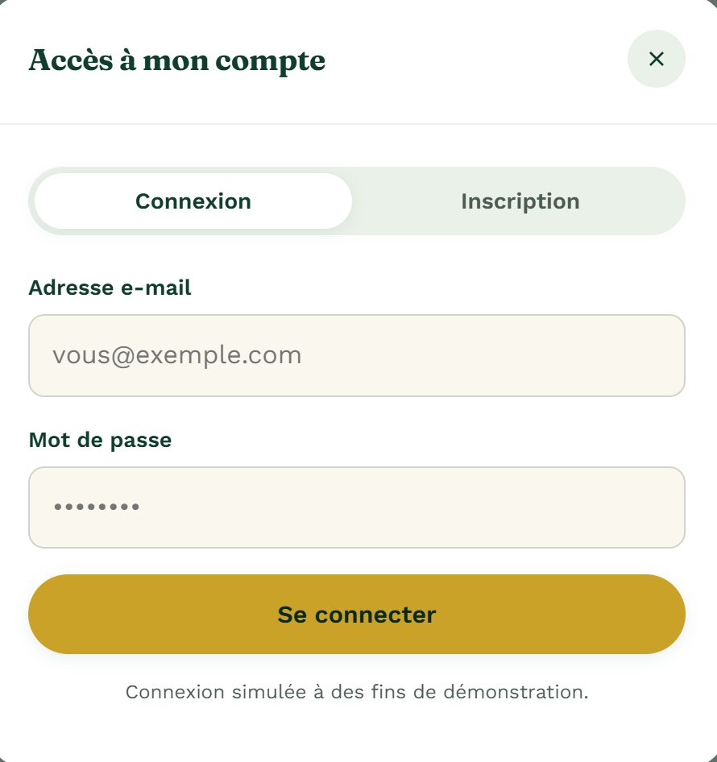
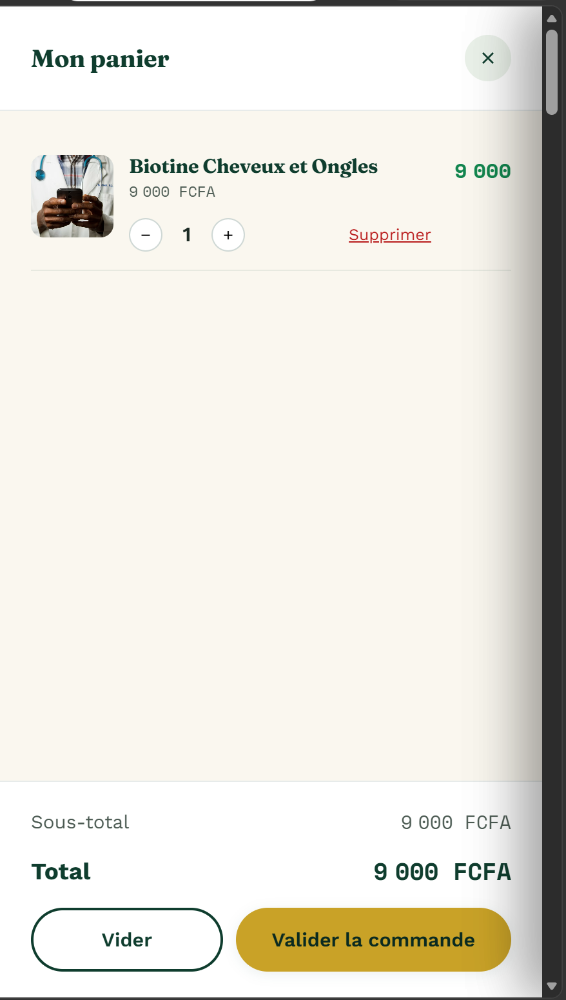
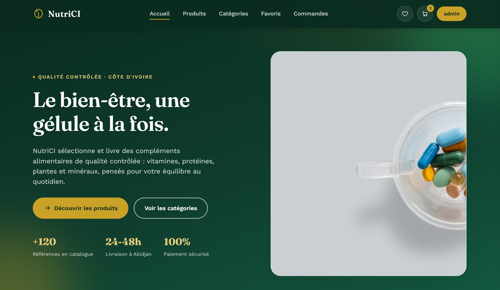

# NutriCI

Mini-projet de Génie Logiciel réalisé en binôme dans le cadre de la classe **L2A**.

## Membres du binôme

| Étudiant | Classe | Compte GitHub |
|---|---|---|
| **KPLE AHOURE THIERRY DAVID** | L2A | [trackssp](https://github.com/trackssp) |
| **ABDOUL KONE** | L2A | [memoblknetflix-debug](https://github.com/memoblknetflix-debug) |

## Présentation

**NutriCI** est une application full-stack de consultation et de gestion de compléments alimentaires.

Elle comprend :

- un backend Spring Boot ;
- une API REST retournant du JSON ;
- une base de données MySQL ;
- un frontend en HTML, CSS et JavaScript natif ;
- des appels au backend avec `fetch()` ;
- des tests JUnit et des scénarios Postman.

Le frontend n’utilise aucun framework comme React, Angular, Vue.js ou Bootstrap.

## Application déployée

- Application : [https://nutrici-production.up.railway.app](https://nutrici-production.up.railway.app)
- API des produits : [https://nutrici-production.up.railway.app/api/produits](https://nutrici-production.up.railway.app/api/produits)
- Dépôt GitHub : [https://github.com/trackssp/NutriCI](https://github.com/trackssp/NutriCI)

> Le premier chargement peut prendre quelques secondes si le service Railway est en veille.

## Captures d’écran

Les captures sont enregistrées dans `documentation/images`.

### Page d’accueil et catalogue



### API REST des produits



### Base de données MySQL déployée



### Déploiement public réussi



### Preuve du travail en binôme sur GitHub



## Technologies

### Backend

- Java 17
- Spring Boot 4.0.7
- Maven
- Spring Web MVC
- Spring Data JPA
- Hibernate
- JUnit

### Frontend

- HTML5
- CSS3
- JavaScript natif
- API `fetch()`
- aucun framework frontend

### Données et outils

- MySQL ou MariaDB
- XAMPP et phpMyAdmin
- MySQL Railway
- IntelliJ IDEA
- Git et GitHub
- Postman

## Structure principale

```text
NutriCI
├── nutrici-api
│   ├── src
│   │   ├── main
│   │   │   ├── java/ci/miage/nutrici
│   │   │   └── resources
│   │   │       ├── static/index.html
│   │   │       └── application.properties
│   │   └── test
│   ├── pom.xml
│   ├── mvnw
│   └── mvnw.cmd
├── postman
├── documentation/images
├── nutrici.sql
└── README.md
```

## Configuration locale de la base de données

| Paramètre | Valeur |
|---|---|
| Nom de la base | `nutrici` |
| Serveur | `localhost` |
| Port | `3306` |
| Utilisateur | `root` |
| Mot de passe | vide |

Fichier de configuration :

```text
nutrici-api/src/main/resources/application.properties
```

```properties
spring.datasource.url=${SPRING_DATASOURCE_URL:jdbc:mysql://localhost:3306/nutrici?useSSL=false&serverTimezone=UTC}
spring.datasource.username=${SPRING_DATASOURCE_USERNAME:root}
spring.datasource.password=${SPRING_DATASOURCE_PASSWORD:}
spring.datasource.driver-class-name=com.mysql.cj.jdbc.Driver

spring.jpa.hibernate.ddl-auto=update
spring.jpa.show-sql=true
spring.jpa.properties.hibernate.dialect=org.hibernate.dialect.MySQLDialect

server.port=${PORT:8080}
```

Les valeurs placées après `:` sont utilisées localement. Sur Railway, elles sont remplacées par les variables d’environnement.

## Comptes de démonstration

### Administrateur

| Champ | Valeur |
|---|---|
| Email | `admin@nutrici.com` |
| Mot de passe | `123456` |
| Rôle | `ADMIN` |

### Client

| Champ | Valeur |
|---|---|
| Email | `client@nutrici.com` |
| Mot de passe | `client123` |
| Rôle | `CLIENT` |

Ces comptes permettent de vérifier les fonctionnalités disponibles selon le rôle.

## Installation locale

### 1. Prérequis

Installer :

- JDK 17 ;
- Git ;
- XAMPP avec MySQL ou MariaDB ;
- IntelliJ IDEA.

### 2. Récupérer le projet

```bash
git clone https://github.com/trackssp/NutriCI.git
cd NutriCI
```

### 3. Importer la base de données

1. Ouvrir XAMPP Control Panel.
2. Démarrer MySQL.
3. Démarrer Apache pour utiliser phpMyAdmin.
4. Ouvrir [http://localhost/phpmyadmin](http://localhost/phpmyadmin).
5. Cliquer sur **Importer**.
6. Sélectionner `nutrici.sql`, situé à la racine du projet.
7. Lancer l’importation.

Le script crée la base `nutrici`, la table `produit` et insère un catalogue de 40 produits.

### 4. Lancer les tests

Sous Windows :

```powershell
cd nutrici-api
.\mvnw.cmd test
```

Résultat attendu :

```text
BUILD SUCCESS
```

### 5. Lancer l’application

```powershell
cd nutrici-api
.\mvnw.cmd spring-boot:run
```

Attendre les messages :

```text
Tomcat started on port 8080
Started NutriciApiApplication
```

### 6. Accéder à l’application locale

- Interface : [http://localhost:8080](http://localhost:8080)
- Produits JSON : [http://localhost:8080/api/produits](http://localhost:8080/api/produits)

## Déploiement sur Railway

Le projet utilise deux services Railway :

1. le service Spring Boot `NutriCI` ;
2. le service de base de données `MySQL`.

Configuration du service Spring Boot :

- dépôt : `trackssp/NutriCI` ;
- branche : `main` ;
- répertoire racine : `/nutrici-api` ;
- port public : `8080`.

Variables d’environnement :

```text
SPRING_DATASOURCE_URL
SPRING_DATASOURCE_USERNAME
SPRING_DATASOURCE_PASSWORD
```

URL JDBC utilisée sur Railway :

```text
jdbc:mysql://${{MySQL.MYSQLHOST}}:${{MySQL.MYSQLPORT}}/${{MySQL.MYSQLDATABASE}}?useSSL=false&allowPublicKeyRetrieval=true&serverTimezone=UTC
```

Utilisateur :

```text
${{MySQL.MYSQLUSER}}
```

Mot de passe :

```text
${{MySQL.MYSQLPASSWORD}}
```

Le mot de passe réel de Railway n’est pas publié dans GitHub. Il est fourni par les variables d’environnement Railway.

Le catalogue est chargé dans MySQL Railway avec l’instruction `INSERT INTO produit` du fichier `nutrici.sql`.

## Fonctionnalités

- catalogue de 40 compléments alimentaires ;
- recherche par nom ;
- filtrage par catégorie ;
- alertes de stock ;
- ajout et suppression de produits ;
- panier et calcul du total ;
- commandes ;
- comptes administrateur et client ;
- authentification ;
- utilisateurs ;
- favoris ;
- avis ;
- notifications ;
- paiement et livraison ;
- historique ;
- promotions ;
- informations nutritionnelles ;
- statistiques.

## Routes principales de l’API

| Méthode | Route | Description |
|---|---|---|
| `GET` | `/api/produits` | Consulter les produits |
| `POST` | `/api/produits` | Ajouter un produit |
| `DELETE` | `/api/produits/{reference}` | Supprimer un produit |
| `GET` | `/api/produits/alertes` | Consulter les stocks faibles |
| `GET` | `/api/produits/recherche?q=...` | Rechercher par nom |
| `GET` | `/api/produits/categorie/{categorie}` | Filtrer par catégorie |
| `GET` | `/api/panier` | Consulter le panier |
| `POST` | `/api/panier` | Ajouter une ligne au panier |
| `DELETE` | `/api/panier/{reference}` | Supprimer une ligne |
| `GET` | `/api/panier/total` | Calculer le total |
| `POST` | `/api/auth/login` | Se connecter |
| `GET` | `/api/commandes` | Consulter les commandes |

## Tests Postman

Les scénarios Postman sont disponibles dans le dossier `postman`.

Ils permettent de vérifier notamment :

- les produits ;
- le panier ;
- les commandes ;
- l’authentification ;
- le paiement ;
- les réponses HTTP `200`, `201`, `204`, `400` et `404`.

## Tests JUnit

Les tests se trouvent dans :

```text
nutrici-api/src/test
```

Commande :

```powershell
cd nutrici-api
.\mvnw.cmd test
```

## Frontend sans framework

L’interface est enregistrée dans :

```text
nutrici-api/src/main/resources/static/index.html
```

Elle utilise uniquement HTML, CSS, JavaScript natif et `fetch()`. Aucun framework frontend n’est utilisé.

## Preuve du travail en binôme

GitHub conserve les preuves du travail effectué par les deux membres :

- branches séparées ;
- commits des deux comptes ;
- pull requests ;
- historique des modifications ;
- deux contributeurs visibles.

Contributeurs :

- [KPLE AHOURE THIERRY DAVID — trackssp](https://github.com/trackssp)
- [ABDOUL KONE — memoblknetflix-debug](https://github.com/memoblknetflix-debug)

## Remarque

Le catalogue des produits est enregistré dans MySQL. Certaines données de démonstration, comme le contenu courant du panier ou certains favoris, peuvent être réinitialisées lorsque le serveur Railway redémarre.

<!-- CAPTURES-NUTRICI-2026 -->
## Démonstration visuelle

### Accueil


### Catalogue connecté à l'API


### Authentification


### Panier


### Administration
Le rôle `ADMIN` dispose d'un espace exclusif permettant d'ajouter, modifier et supprimer les produits. Ces opérations sont également protégées côté backend par le jeton administrateur. Le rôle `CLIENT` peut consulter le catalogue et commander, mais ne peut pas administrer les produits.



### Réponse JSON de l'API REST


## Différence entre les rôles

| Fonctionnalité | Client | Administrateur |
|---|:---:|:---:|
| Consulter et rechercher les produits | Oui | Oui |
| Ajouter au panier et commander | Oui | Oui |
| Accéder au tableau de bord d'administration | Non | Oui |
| Ajouter un produit | Non | Oui |
| Modifier le prix, la catégorie ou le stock | Non | Oui |
| Supprimer un produit | Non | Oui |